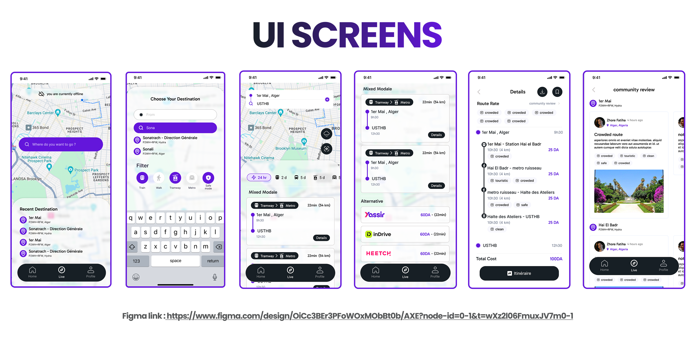
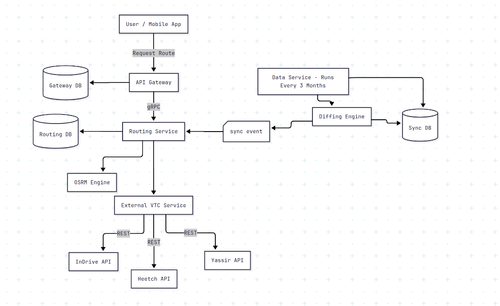
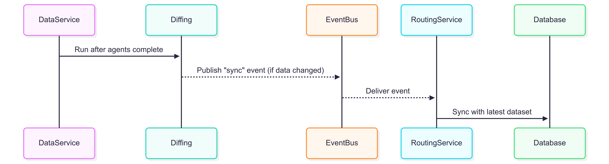
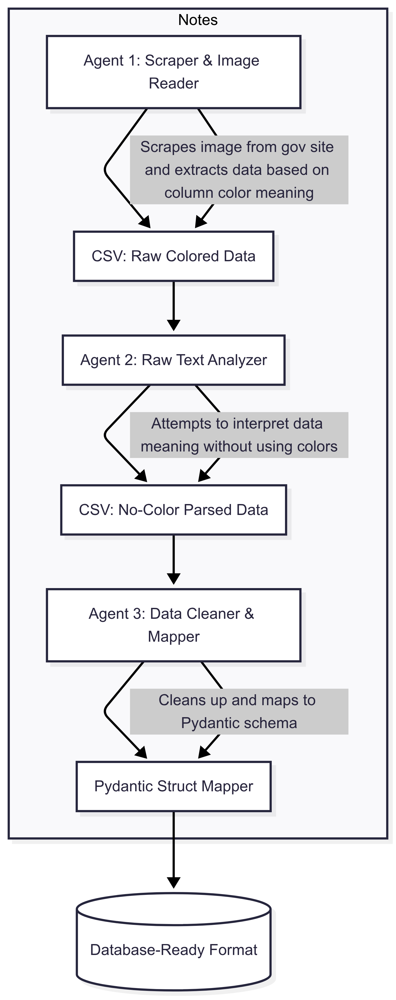

# AXE Server - Smart Transportation & Mobility Platform

**AXE Server** is a high-performance, microservices-based transportation platform designed to transform mobility in Algeria. It intelligently integrates **public transport (bus, metro, train)** and **private ride-hailing (VTC)** services to deliver the **optimal route, time, and price** to users — all in real-time.

>  Powered by AI agents, OSRM, Kafka, RabbitMQ, and a rock-solid Go + Python backend.

---

##  Architecture Overview

AXE follows a modular microservices architecture with **clear domain separation**, high availability, and AI capabilities.

### Core Services

| Service         | Tech Stack                    | Purpose                                |
|-----------------|-------------------------------|----------------------------------------|
|  Gateway      | Go, gin, OAuth 2.0, gRPC     | API Gateway, Auth, Routing orchestration |
|  Routing      | Go, OSRM, RabbitMQ, PostgreSQL | Multi-modal journey planner            |
|  VTC          | Go, Geocoding           | Ride-hailing & dynamic pricing         |
|  Data         | FastAPI, RabbitMQ ,Agents         | AI-powered data collection & sync      |

### UI Screens 


### High Level Architecture Overview
 

### Data Service Architecture Overview




---

## Service Breakdown

###  Gateway Service
- Built with **Go + gin**
- Handles **OAuth 2.0 login** (Google)
- Issues **JWT tokens** to secure access
- Uses **gRPC** to communicate with Routing and VTC services
- Aggregates multi-modal routes (Public + VTC)

**Key Endpoints:**
- `/auth/google`
- `/routes/best`
- `/vtc/prices`
- User management APIs

---

###  Routing Service
- Built with **Go + GORM**
- Integrates **OSRM** for road-based routing
- Supports **bus, tram, train, metro, private transport**
- Real-time updates via **RabbitMQ**

**Data Models:**
- `Stations`: With GPS and safety scores
- `Lines`: Public routes with fares/schedules
- `Stops`: Sequenced line stops
- `Journeys`: Optimized multi-transfer trips

**Key Features:**
- Route safety rating
- Dynamic fare calculation
- Public transport schedules
- Integration with Data Service for sync

---

###  VTC Service
- Built with **Go**
- Kafka-based **event-driven architecture**
- Dynamic pricing, geolocation, driver/passenger matching

**Key Features:**
- `getVtcPrices()` — surge-based real-time estimates
- Multi-provider integration
- Location-to-location time/distance estimation

---

###  Data Service (Multi-Agent AI)
- Built with **FastAPI + Python**
- **3 AI Agents**:
  - `ScraperAgent` → Fetches raw transport data
  - `CleanerAgent` → Normalizes and validates
  - `FinalizerAgent` → Formats and stores in DB
- **Post-processing Diffing Algorithm** compares finalized output with database.
  - If changes detected → emits sync event to Routing Service via RabbitMQ
  - Else → No-op

---

##  Infrastructure & Tooling

| Layer             | Tech                         |
|------------------|------------------------------|
| Messaging        | RabbitMQ (public), Kafka (VTC) |
| Databases        | PostgreSQL (shared schema)   |
| Auth             | OAuth 2.0 + JWT              |
| Containerization | Docker Compose               |
| Comm Protocols   | REST (clients), gRPC (internal), Webhooks |
| Orchestration    | Internal service discovery   |

---

## Business Logic Highlights

-  **AI-Powered Processing**: Clean, validate, and sync transport data in real-time.
-  **Multi-Modal Smart Routing**: Combines public + private transport options.
-  **Pricing Engine**: Compares public fares vs. VTC surge pricing.
-  **Real-Time Updates**: Station availability, delays, and new lines.
-  **Secure and Modular**: Authenticated API access with scalable microservices.

---

##  Target Market & Use Cases

**Focus Region:** Algeria (especially Algiers)

### Use Cases:
- **Commuters**: Work/school optimization
- **Tourists**: Easy transport discovery
- **Price-Conscious Riders**: Compare cheapest route
- **Infrastructure Teams**: Use AI insights for public transport improvement

---

##  Getting Started

### Prerequisites
- Docker + Docker Compose
- Go 1.24.4+
- Python 3.10+
- Node.js (for frontend, if applicable)

### Run Locally

```bash
git clone https://github.com/axe-junction/axe.git
cd axe
docker-compose up --build
```

---

##  Repo Structure

```
/gateway         # Gin + Go for authentication and orchestration (packages/gateway)
/routing         # Public transport service with OSRM logic (packages/routing-service)
/vtc             # Ride-hailing service with dynamic pricing logic (packages/vtc-service)
/data_service    # FastAPI multi-agent system for data extraction/cleaning (packages/data-service)
/proto           # gRPC definitions (packages/gateway/pkg/pb)
/config          # Config files like env, db setup (under internal/config across services)
/docs            # UML diagrams, architecture, and design references (./docs)
/client          # React Native frontend (mobile)
/web             # Web frontend built with React + Vite
/shared          # Shared code/resources across services (currently empty or reserved)
/deployments     # Kubernetes, Docker Swarm, or infra-as-code setup
```

---

##  License

Licensed under the MIT License. See `LICENSE` for more.


---

> *AXE Server is not just a platform — it's the future of urban mobility in Algeria.* 🇩🇿

---

