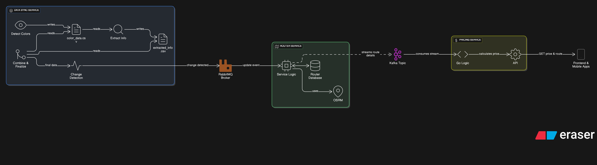

# AXE

This repository contains the source code and documentation for a distributed system designed for real-time route calculation and dynamic pricing. It's built on a microservices architecture, leveraging event-driven patterns for high scalability and resilience.

## System Architecture

The core of our system is represented by the following diagram. It illustrates the flow of data for both live user requests and asynchronous background data updates.

## Core Concepts

This system is designed around a few key architectural principles:

  * **Microservices:** Each major function (Routing, Pricing, Data Sync) is a separate, independently deployable service. This allows for easier development, scaling, and maintenance.
  * **API Gateway:** The `Router Service` acts as a single entry point for all client applications (Frontend & Mobile). This simplifies the client-side code and centralizes concerns like authentication and rate-limiting.
  * **Event-Driven Communication:** Services communicate asynchronously using a message broker (`RabbitMQ`) for discrete events and a streaming platform (`Apache Kafka`) for high-throughput data streams. This decouples the services and makes the system more resilient to individual service failures.

## Component Breakdown

  * ### 🚚 Data Sync Service

    This service is the starting point for all system data. It uses a chain of agents to process input data (e.g., from CSV files), detect changes, and initiate the data update workflow by publishing an event.

  * ### Gateway & Router Service

    This is the brain of the operation and has two primary responsibilities:

    1.  **API Gateway:** It exposes a public API for clients, handling incoming requests for routes and prices.
    2.  **Routing Engine:** It integrates with **OSRM (Open Source Routing Machine)** to perform complex route calculations. It also consumes events from `RabbitMQ` to keep its own database up-to-date.

  * ### 💰 Pricing Service (Go)

    A dedicated microservice written in Go responsible for all pricing logic.

      * It exposes an internal API that the `Router Service` calls to get the price for a specific route.
      * It asynchronously consumes data streams from `Apache Kafka` to update its own pricing models and cache, ensuring it always has fresh data without slowing down live requests.

  * ### 📨 Messaging Infrastructure

    The backbone of our asynchronous communication.

      * **RabbitMQ:** Used for reliable, event-based messaging. It's perfect for sending commands or discrete notifications, like a "data has changed" event.
      * **Apache Kafka:** Used for high-throughput data streaming. It's ideal for broadcasting data updates to multiple consumers or for feeding analytics and machine learning systems.

## System Workflows

The diagram shows two primary workflows that happen concurrently:

#### 1\. Live Request Flow (Synchronous)

This is what happens when a user requests a route in the app.

1.  The **Client App** sends a `GET /api/route` request to the **Router Service**.
2.  The **Router Service** calculates the route using **OSRM**.
3.  The **Router Service** calls the **Pricing Service's** internal API to get the price for that route.
4.  The **Pricing Service** calculates and returns the price.
5.  The **Router Service** combines the route and price into a single response and sends it back to the client.

#### 2\. Background Data Flow (Asynchronous)

This flow keeps the system's data fresh without interrupting users.

1.  The **Data Sync Service** detects a change and publishes an event to **RabbitMQ**.
2.  The **Router Service** consumes this event and updates its local database (e.g., new roads, traffic info).
3.  After updating, the **Router Service** streams the relevant data changes to an **Apache Kafka** topic.
4.  The **Pricing Service** (and any other interested services) consumes this stream to update its own internal data, models, or cache.
#### 3\. System design

## Technology Stack

  * **Programming Languages:** Go (Pricing Service),fastapi(data service),typescript(front mobile)
  * **Routing Engine:** OSRM
  * **Message Broker:** RabbitMQ
  * **Streaming Platform:** Apache Kafka
  * **Databases:** *(sqlite, PostgreSQL, Redis)*
  * **Clients:** Web ( React) and Mobile (react native)


1.  Clone the repository:

w the setup instructions for each service... (e.g., using Docker Compose)
    ```bash
    docker-compose up --build
    ```

-----